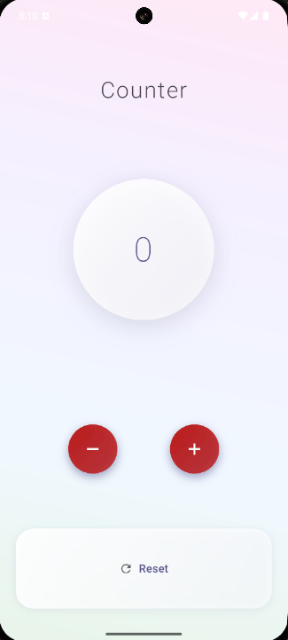
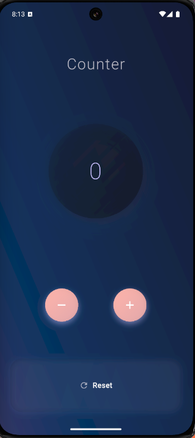

# day_01_counter_app

# 🌟 Beautiful Counter App - Flutter

A modern, elegant, and minimal **Counter App** built using Flutter.  
It’s not just another counter — it's a UI design showcase featuring glassmorphism, smooth animations, and adaptive themes.

---

## ✨ Features

- 🔢 Elegant central counter with animated transitions
- 🎨 Glassmorphic or gradient-based UI (customizable)
- 🌗 Smart light/dark mode with smooth transitions
- ➕➖ Floating increment/decrement buttons with ripple effects
- 🔄 Reset button with smart UI placement
- 💡 Responsive across screen sizes
- 🧠 Built with clean architecture and `Provider` state management

---

## 📸 Screenshots

| Light Mode | Dark Mode |
|------------|-----------|
|  |  |

---

## 🚀 Getting Started

1. **Clone the repo**
   ```bash
   git clone https://github.com/moshaddaque/day_01_counter_app.git
   cd beautiful_counter_flutter
